A glimpse into my work, collaborations, teaching moments, and field activities.

---

## Teaching R Workshops

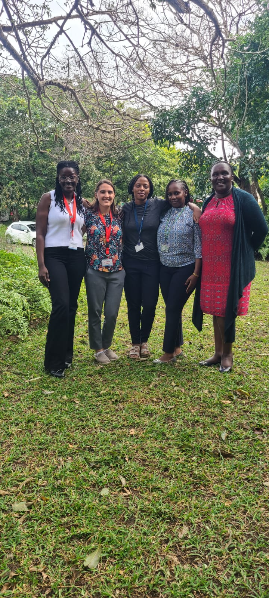{width=100%}

*Meet the instructors: R training workshop for data managers and public health professionals (2025), held at KEMRI Kilifi Kenya .*

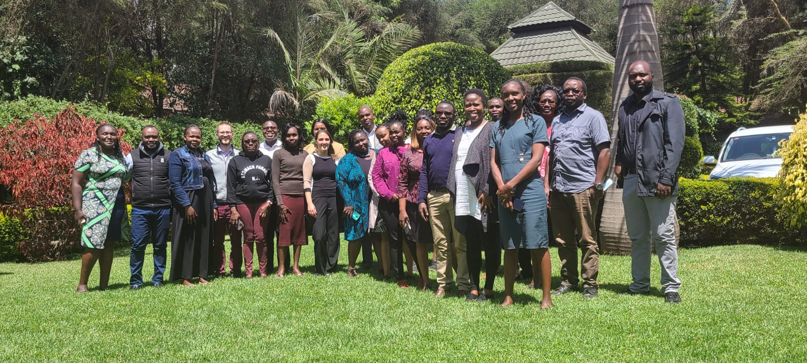{width=100%}

*Cohort One of DiscovR – the maiden training during the COVID period. I organized, facilitated, and learned a great deal from this experience.*

{width=100%} 

*Cohort 2 of DiscovR: A 4 day in interactive in person training .*

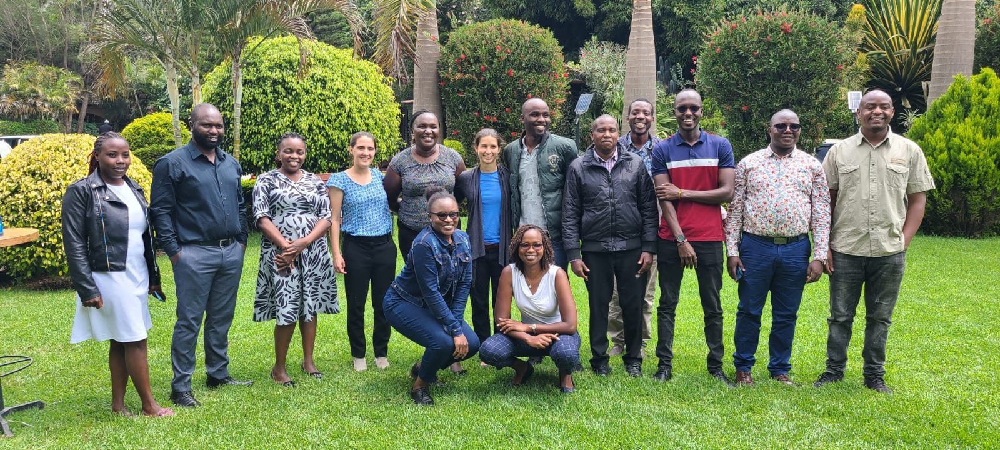{width=100%} 

*Cohort  of DiscovR2023: A 4 day in interactive in person training .*

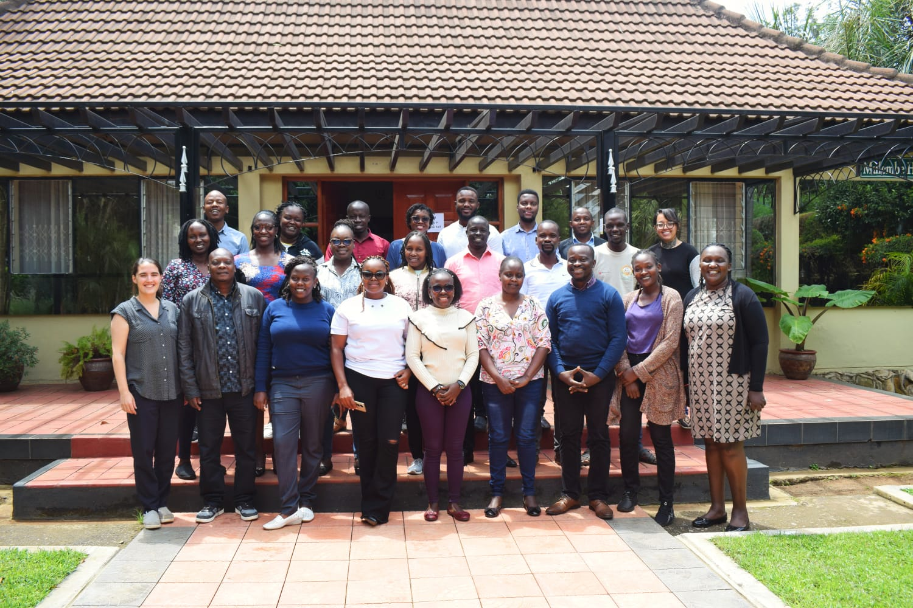{width=100%}

*R training workshop session with participants practicing data analysis (2024).*

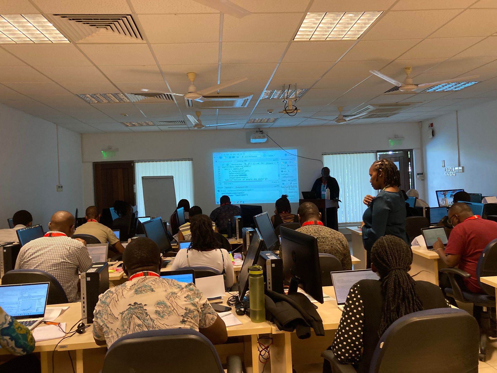{width=100%}

*Interactive code_along cohort of 2025 at Kemri_Kilifi.*

---

## Field Work & Research Activities

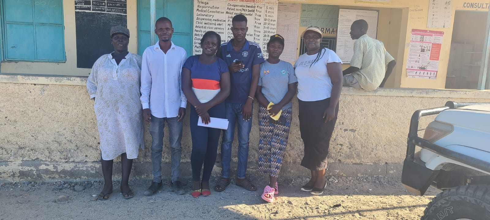{width=100%}

*Malaria surveillance activities during field data collection in Turkana.*

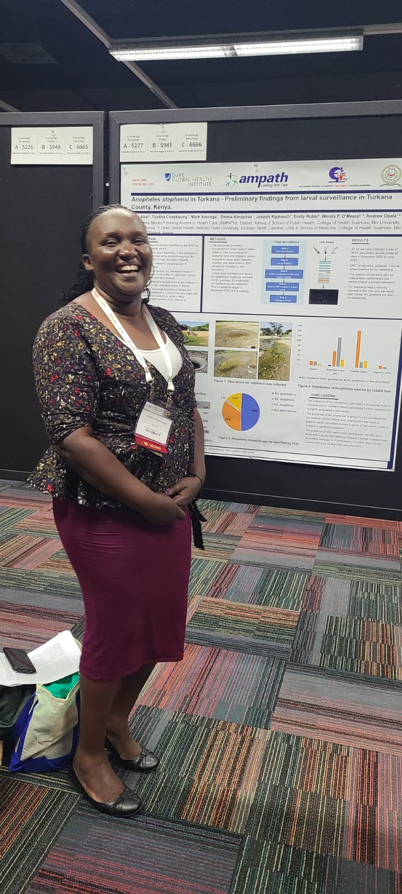{width=100%}

*Presenting malaria research findings at the ASTMH conference.*

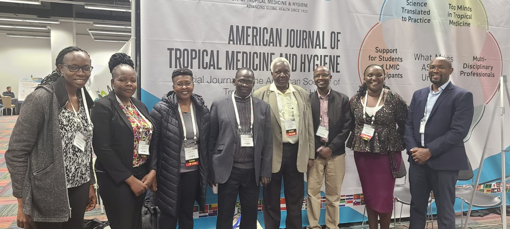{width=100%}

*Presenting malaria research findings at the ASTMH conference with principal investigators and mentors.*

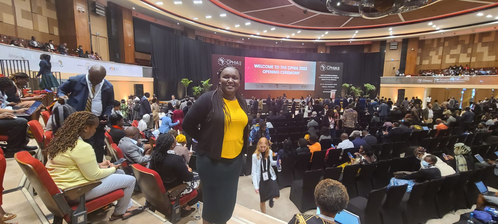{width=100%}

*Presenting malaria research findings at the CPHIA Rwanda conference.*

---

## Training & Capacity Building

{width=100%}

*Training field teams on digital data collection systems.*

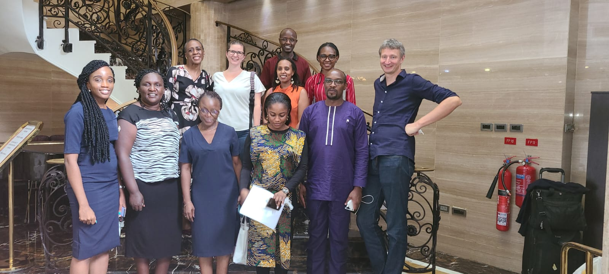{width=100%}

*Partnership collaboration with CHAI Nigeria for the TESTsmart project.*

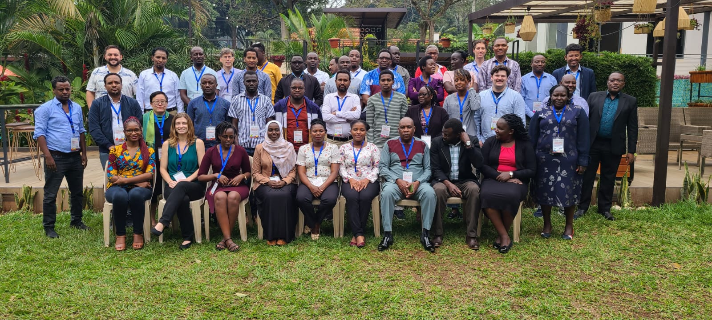{width=100%}

*Hands-on data management training on malaria genomics in Kampala, Uganda, organized by the African Union.*

